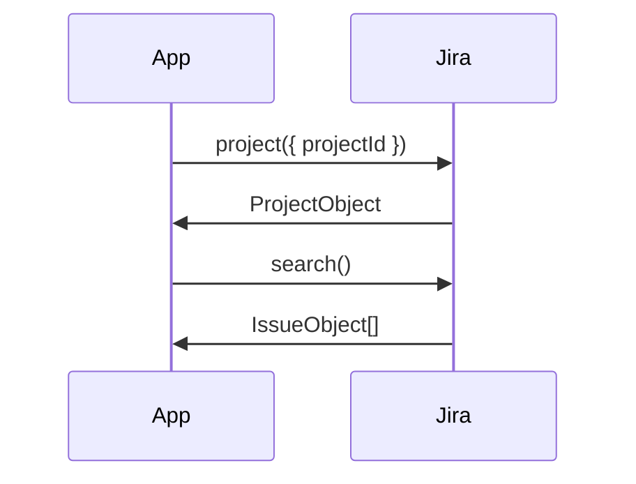

- this project is for testing jsdoc with better-docs and jsdoc-mermaid 

* Testing

```mermaid
 sequenceDiagram
  participant App
  participant Jira
  App->>Jira:project({ projectId })
  Jira->>App:ProjectObject
  App->>Jira:search()
  Jira->>App:IssueObject[]
```